**华东师范大学软件学院课程项目报告**

 

| **课程名称**：智能终端操作系统                              |                             | **成绩**：         |
| ----------------------------------------------------------- | --------------------------- | ------------------ |
| **项目名称** 基于pynq-z2按键和语音识别控制的linux终端小游戏 |                             |                    |
| **姓名：** xxx         **学号：** 10215101546               | **班级：** 智能终端操作系统 | **同组成员：单人** |

 

 

（项目简介，技术原理，实现方法与步骤，个人贡献，项目心得总结等）

**一．**项目简介

该项目使用pynq-z2开发板实现了一个具有语音交互特性的有趣小游戏，玩家可以通过按键和语音操控自己扮演的角色躲避障碍物，拾取生命值，以长时间存活作为游戏目标，该项目基于嵌入式Linux和python，使用PYNQ-Z2开发板开发。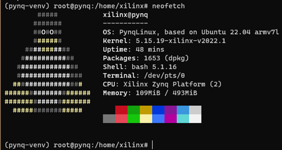

该项目具有多种方式输入控制信号（pynq的按键和语言输入），游戏画面输出实时刷新，结果显示在终端，当撞上障碍物时，开发板的灯光亮起作为警告，正常游戏状态关闭灯光，在游戏进行中可以拨动开关动态改变游戏难度（共四种）。游戏的进程在开发板上实时处理并接受对输入信号进行响应。

二．技术原理   

Pynq-Overlay：

Overlays，或者硬件库，都是可编程FGPA的设计理念。通过它们，用户可以把Zynq处理系统（Processing System of the Zynq）上的应用扩展到可编程逻辑层面上。Overlays可以用来加速软件应用或者为特定的应用自定义其硬件平台。

举例来说，FPGA可提供加速的一个经典案例便是图像处理。而一个软件工程师可以在FPGA结构上使用一个overlay进行相似的图像处理操作（比如边缘检测）。Overlays可以依据需求动态的加载到FPGA上，就像调用软件库一样。在这个例子里，不同overlay上的图像处理函数可以根据Python的指令分别进行加载调用。

PYNQ提供了一个Python交互界面，允许我们通过处理系统上的Python来控制可编程逻辑里的overlays。FPGA设计是一个非常专业化的任务，这需要专业的硬件工程知识。PYNQ的overlays就是由硬件设计师创建，并且包装成了PYNQ PYTHON API。软件开发者就可以无需重新自己设计overlay，而是直接使用这些写好的overlay来操作特定的硬件模块。这其实和专业软件工程师设计软件库并把它们包装成用户可用的API的道理一样。

此处由于项目的时间限制，使用了比较基层的base overlay，是已经烧写在SD卡上的，对应于base.bit。我们可以用下图的方法加载Overlay 

from pynq.overlays.base import BaseOverlay

base = BaseOverlay("base.bit")

通过对硬件库的调用，可以方便的操作FPGA的硬件，包括按键，开关，led灯等

Python 3.10：

 

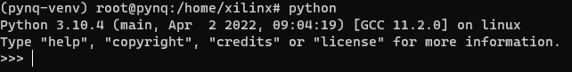

我下载的系统镜像取自官方https://github.com/Xilinx/PYNQ/releases ，适用于pynq-z2的v3.0版本，支持python3.10，PYNQ 可以认为是 Python+ZYNQ，python是PYNQ区别于传统fpga开发的一大特点，也是软硬件结合的一种方式，因此在对硬件了解不够深入的情况下，选择python作为开发语言是满足PYNQ的基本思想的，也就是软件开发人员可以使用 Python 接口来编程和控制 overlay，无需参与硬件设计。

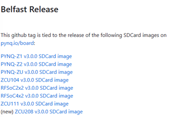

Python speech_recognition：

 

一个开源的面向 Python 的语音识别模块，支持多种引擎和 API，可以在线和离线使用。项目地址https://github.com/Uberi/speech_recognition

满足几种主流语音 API ，灵活性高；SpeechRecognition无需构建访问麦克风和从头开始处理音频文件的脚本，可以自动完成音频输入、检索并运行，提供了多个Speech recognition engine/API support，其中CMU Sphinx可以本地部署训练模型并离线运行（此处可以利用FPGA的强大加速功能），其他的则需要在线调用。

在我所构建的程序中，因为没有麦克风，需提前录制.wav格式的音频文件，上传到pynq-z2开发板上，程序接收到指挥左右移动的语音后转换位为文字，并将其携带的对应的控制信号放入队列中，程序开始运行后，会按照存储在队列里的操作数进行对应的移动操作

 

三．实现方法与步骤 

1.环境搭建  

在官方github仓库下载python 3.8+的pynq-z2镜像，并烧写进sd卡，更改pynq-z2跳帽为从sd卡启动

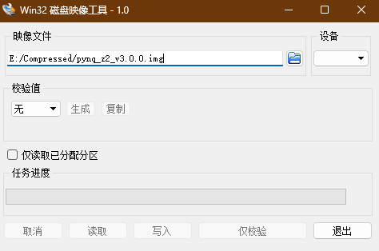

通过网线连接pynq-z2和电脑，设置好网络共享

在windows终端输入Arp-a，找到开发板ip地址

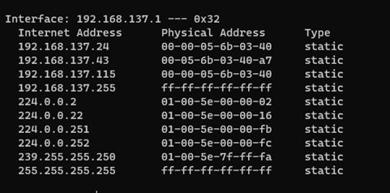

然后就可以在终端ssh [xilinx@192.168.137.24](mailto:xilinx@192.168.137.24)连接上开发板(或者在浏览器中打开jupyter notebook)

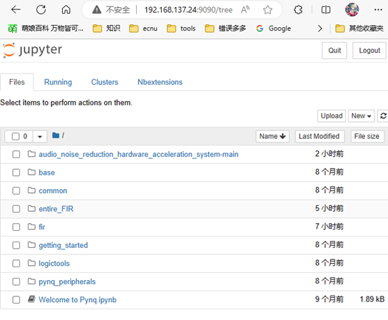

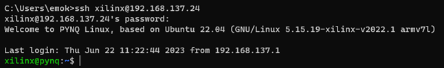

然后安装speech_recognition python库,注意要安装最新版本的文件，因此不能直接使用pip install来安装，手动下载项目文件，拖入xilinx文件夹中解压，运行以下指令安装

***sudo python setup.py install\***

安装好后，在pip list里显示为

 

如果要用麦克风作为输入，还需要下载PyAudio库 

***sudo apt-get install python-pyaudio python3-pyaudio\***

因为我宿舍没有麦克风，就没有做这一步

 

我原本的打算是使用PocketSphinx recognizer在本地运行语音识别代码，最好能借助fpga强大的硬件加速性能来对此过程进行处理，但是在踩坑之后发现其需要在支持64位的系统上才有wheel而且对linux的支持不足，要想使用需要从源码重新构建，并且兼容性问题比较大。我在windows上尝试使用过此模型，语音识别的精准度不高，还需要自己找数据训练本地模型。受限于实验的时间，我暂时搁置了此方案，采用了Microsoft Azure提供的api

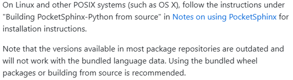

至此，基本开发环境搭建完成

\2. 代码实现（和game.py文件里的基本一样）

①硬件部分块

\#此部分调用base.bit硬件库接口

from pynq.overlays.base import BaseOverlay

base = BaseOverlay("base.bit")

led0 = base.leds[0]  # Corresponds to LED LD0

led1 = base.leds[1]  # Corresponds to LED LD1

led2 = base.leds[2]  # Corresponds to LED LD2

led3 = base.leds[3]  # Corresponds to LED LD3

b0 = base.buttons[0]

b1 = base.buttons[1]

b2 = base.buttons[2]

b3 = base.buttons[3]

s0 =base.switches[0]

s1 =base.switches[1]

此处使用base.bit作为基本的硬件设计，要使用fpga加速的话要重新设计硬件部分

②音频部分块

 

 

\#此部分是语音输入和识别的主体

import speech_recognition as sr

import re

import queue 

from os import path

from queue import Queue

q = Queue() 

AUDIO_FILE = path.join(path.dirname(path.realpath(__file__)), "lefte.wav")

\# use the audio file as the audio source

r = sr.Recognizer()

with sr.AudioFile(AUDIO_FILE) as source:

\#调整环境噪音,这部分大概也可以用FPGA加速

  r.adjust_for_ambient_noise(source)

  audio = r.record(source)  # read the entire audio file

os.system('clear') 

print("The program is loading and trying to understand your words ...")

\# recognize speech using Microsoft Azure Speech

AZURE_SPEECH_KEY = "ce75478025d34093a355ee8889881815"  # Microsoft Speech API keys 32-character lowercase hexadecimal strings

AZURELOCATION = "eastasia"

try:

  text = r.recognize_azure(audio, key=AZURE_SPEECH_KEY, location=AZURELOCATION)

  \#print("Recived: " + str(text))

  print("Words Received!")

except sr.UnknownValueError:

  print("Microsoft Azure Speech could not understand")

except sr.RequestError as e:

  print("Could not request results from Microsoft Azure Speech service; {0}".format(e))

\#print(re.findall(r'\b\w+\b', str(text)))利用正则语句转化单词为0，1控制语句放入队列

it = re.finditer(r"[\ba-zA-Z]+",str(text)) 

for match in it: 

  \#print (match.group() )，考虑了部分误差

  if match.group() == 'left'or match.group() == 'Left' or match.group() == 'NIFT' or match.group() == 'Gift' :

​    \#print("0")

​    q.put(0)

  elif match.group() == 'right'or match.group() == 'Right' :

​    \#print("1")

​    q.put(1)

若使用Sphinx本地模型则将text = r.recognize_azure 替换为r.recognize_sphinx，也不需要api的key ；若使用麦克风实时输入语音则需要将sr.AudioFile(AUDIO_FILE)换成mic = sr.Microphone()，我因为实验设施没有，就采用文件输入，本质相似

语音指令识别后经过正则匹配，转化为对应的信号量存入队列中，这些信号量将在游戏执行时被取出来控制玩家左右移动

③游戏提示信息

\#游戏提示信息

print("The deque stored your words,left->0,right->1")

print(q.queue)

print("In this game, your HP:) and living time will be show on the TOP of the terminal ")

print("You should use buttons(btn1&btn0) on pynq-z2 or your words to control YOURSELF 'O' to escape the obstacles 'X' and eat 'H' to add your HP (Both are OK)")

print("When you are hit by an obstacle, the four led on the board will be light on,and you will lose one HP")

print("You can use the 2 switches on the board to adjust the game's difficulty at any time ")

\#os.system('pause')

getpass.getpass("Press Enter to start the game...")

这部分在语音识别完成后，游戏开始前显示在终端，可以显示出语音识别到的要操作的指令，以及讲解一下游戏的操作模式

\1.   玩家操作一个’o’字符，躲避障碍物‘X’，吃掉‘H’来回复HP

\2.   玩家可以使用pynq上的btn1和btn0两个按键控制左右移动，或者使用语音指令来控制，两者可同时使用

\3.   玩家碰到障碍物会损失一点HP，同时PYNQ上的四个LED灯长亮表示警戒，正常游戏或者退出游戏时LED均为熄灭状态

\4.   玩家可以利用PYNQ上的两个switch随时调整游戏难度，并且实时生效

 

④游戏代码主体

\#此部分开始为游戏代码

\# Game settings

WIDTH = 30

HEIGHT = 30

PLAYER = 'O'

OBSTACLE = 'X'

EMPTY = ' '

LOVE = 'H'

start_time = time.time()

\# Initialize player and obstacles

player_pos = WIDTH // 2

obstacles = []

hp = 5

love_pos = [HEIGHT-2, random.randint(0, WIDTH-1)]

\# Game loop

while True:

  \# Move obstacles

  dif=s0.read()+s1.read()*2

  for j in range(WIDTH-20):

​    if random.random() < 0.1*(dif+1):

​      obstacles.append([0, random.randint(0, WIDTH-1)])

  for obstacle in obstacles:

​    obstacle[0] += 1

​    

  \# Move love item

  love_pos[0] += 1

  if love_pos[0] == HEIGHT:

​    love_pos = [0, random.randint(0, WIDTH-1)]

 

  \# Check for collision with love item

  if love_pos[0] == HEIGHT-1 and love_pos[1] == player_pos:

​    hp += 1

​    love_pos = [0, random.randint(0, WIDTH-1)]

 

  \# Check for collision with obstacles

  for obstacle in obstacles:

​    if obstacle[0] == HEIGHT and obstacle[1] == player_pos:

​      hp -= 1

​      led0.on()

​      led1.on()

​      led2.on()

​      led3.on()

​      print("You hit an obstacle! HP:", hp)

​      end_time = time.time()

​      print("Elapsed time:", gametime, "seconds.")

 

​      if hp == 0:

​        print("Game Over! ")

​        led0.off()

​        led1.off()

​        led2.off()

​        led3.off()

​        exit(0)

​      response = input("Do you want to continue? (y/n)")

​      led0.off()

​      led1.off()

​      led2.off()

​      led3.off() 

​      if response.lower() == 'n':

​        print("Game Over!")

​        print("Elapsed time:", gametime, "seconds.")         

​        exit(0)

​     

  obstacles = [obstacle for obstacle in obstacles if obstacle[0] < HEIGHT]

 

  \#在终端绘制游戏图形

  \# Draw game

  os.system('clear')  # Use 'cls' instead of 'clear' on Windows

  for i in range(HEIGHT):

​    for j in range(WIDTH):

​      if [i, j] in obstacles:

​        print(OBSTACLE, end='')

​      elif i == HEIGHT-1 and j == player_pos:

​        print(PLAYER, end='')

​      elif i == love_pos[0] and j == love_pos[1]:

​        print(LOVE, end='')

​      else:

​        print(EMPTY, end='')

​    if i == 0:

​      end_time = time.time()

​      gametime=round(end_time - start_time, 2)

​      print(" TIME: ",gametime,"Difficulty: ",dif," HP: " + "H" * hp)

​      if not q.empty():

​        print("Voice CONTROL LIST:"+str(q.queue))

​    print()

  time.sleep(0.1)

  a=-1

  if not q.empty():

​    a=q.get_nowait()

  if b1.read() or a==0:

​    player_pos = max(0, player_pos - 1)

  elif b0.read() or a==1:

​     player_pos = min(WIDTH - 1, player_pos + 1)

最开始的是游戏显示的区域和基本的符号定义，本来采用的是❤表示love，但是它不是ascii码就换成H了，然后是障碍物初始化，使用随机数产生数量，通过拨动switch改变dif可以改变判断随机数的范围来加大或者减少难度。然后是H和障碍物的移动逻辑，每次循环向下移动一个单位，中间是碰撞判断，比如吃到H和X的不同执行，每次撞着就把led灯置为全亮，最后是绘制终端游戏图形（打印出来）以及音频输入和按键输入控制玩家移动的代码。

3．运行情况及截图

cd ~ #进入存有游戏和音频文件的目录

su  #进入特权态

source /etc/profile.d/pynq_venv.sh #这两句用来进入虚拟环境

source /usr/local/share/pynq-venv/bin/activate

python game.py  #运行代码

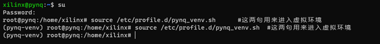

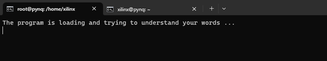

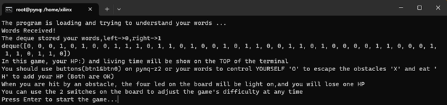

游戏正常运行

 

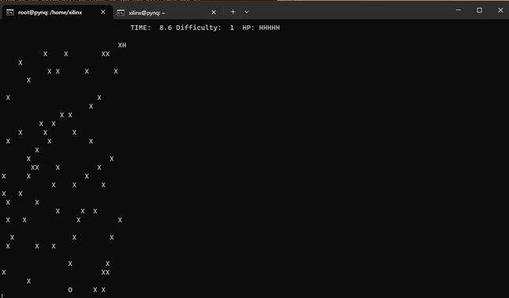

游戏撞弹

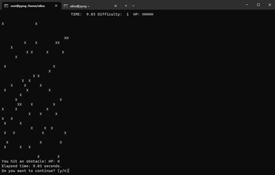

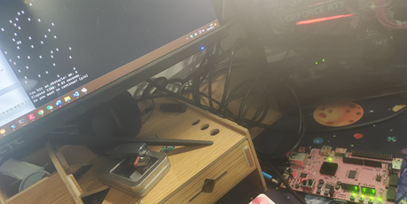

撞到障碍物后led灯长亮

主动退出：

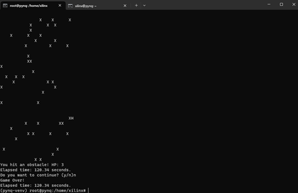

HP为0退出：

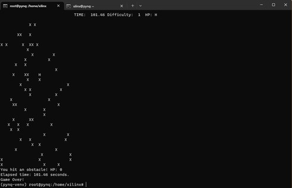

语音控制状态：

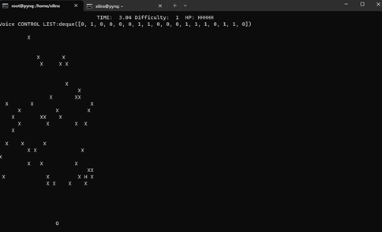

List为空时结束控制

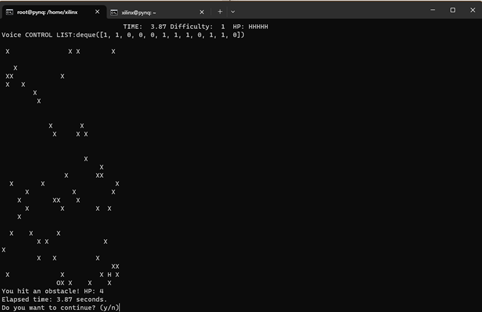

其他功能，比如拨动开关改变难度和两种控制模式会在视频里详细展示。

四．个人贡献

已有工作：

Speech_recognition https://github.com/Uberi/speech_recognition

Microsoft Azure service

Base.bit

Pocketsphinx https://github.com/bambocher/pocketsphinx-python

个人贡献:

整个实验的思路和设计方式均由个人独立完成，部分功能的实验利用了开源软件库，将其作为调用嵌入游戏开发的流程中，实现游戏操作方式的改变。

其余贡献体现在于语音识别部分外游戏部分代码的整体编写和功能实现，以及利用pynq-z2开发板硬件资源作来操作控制游戏代码运行，明确了自主设计训练pynq加速语音识别的优化方向，为后续开发升级做准备。

 

五．创新点/亮点

项目发挥了PYNQ开发优势，利用设计好的硬件库在python环境下控制pynq的按键，开关，灯光等硬件（若时间充分，还可以在此好好利用pynq硬件加速功能，发挥fpga特点）

 

项目实现了一个完整的嵌入式Linux终端小游戏，包括多元操作方式的输入，软件和硬件提示信息的输出，游戏胜负的判定，通过硬件实现游戏难度的实时改变，整个游戏具有稳定性和一定的可玩性，具有可裁剪性，不依赖于gui可以移植到多元化的平台运行。

 

项目尝试引入语音处理ai技术，既为游戏增添了识别度，又可以把此次简单项目当作对语音处理技术和fpga硬件加速设计的一个入门尝试。

 

六．项目心得总结 

这是第一次在python上直接调用硬件使用，和以往课堂上裸机编程操作按键，led等方式相比，无论是调用还是写入都方便不少，体会到了PYNQ区别于ZYNQ的‘P’的优势。

总的来说这次的项目其实完成度还算可以，基本的功能都实现了，不过期末考试的挤压，存在一些时间上的因素限制自身能力水平受限，没有足够的学习和调试时间，许多一开始设想的方案被搁置，不得不牺牲一些功能或者改变实现模式.

如果有更加充分的时间和开发经验,这部分差在python编程语言的熟练度，fpga硬件设计实践，人工智能训练等方面，以上的几点我平时学习开发都较少涉及，这次算是比较针对性的学习了一些，对个人能力起到了一定的锻炼，也让我正视了自己一些能力的缺陷，在暑假等课余时间可以好好弥补这些不足。        